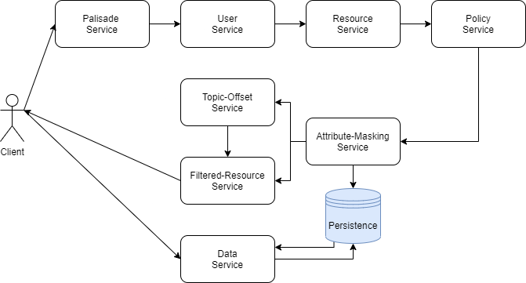
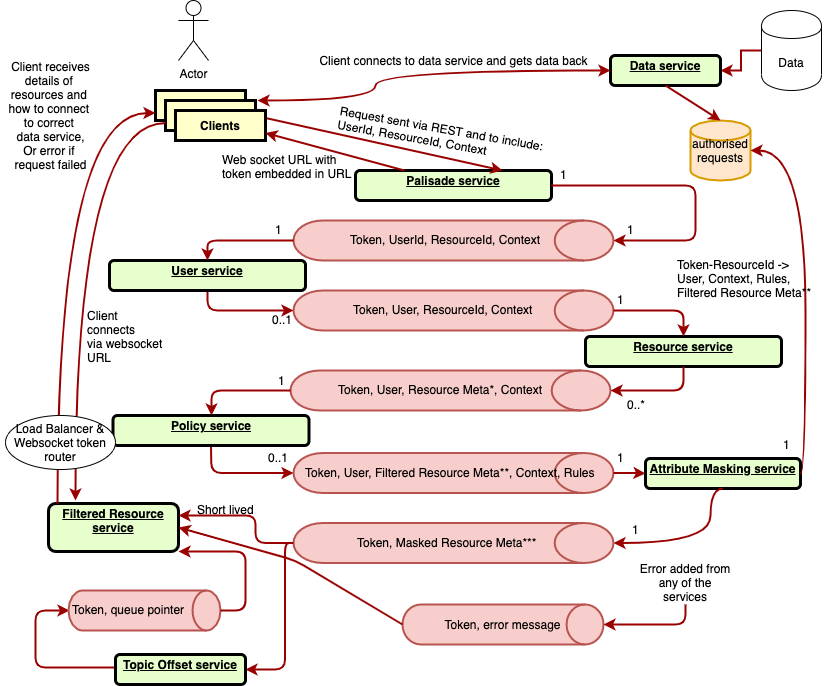
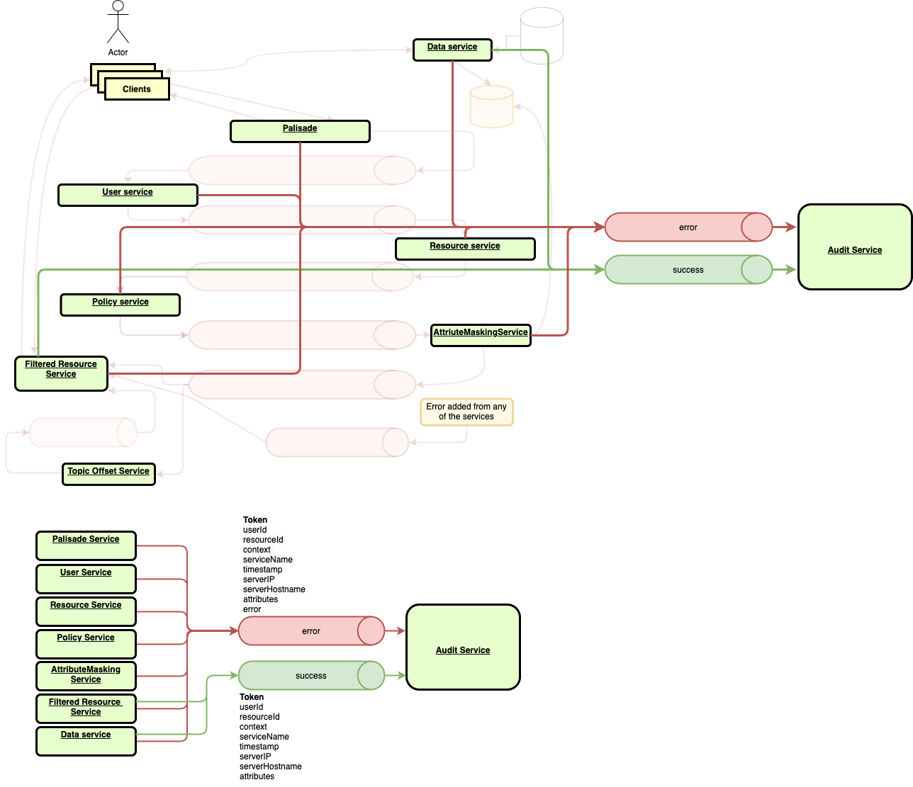

<!---
Copyright 2018-2021 Crown Copyright

Licensed under the Apache License, Version 2.0 (the "License");
you may not use this file except in compliance with the License.
You may obtain a copy of the License at

  http://www.apache.org/licenses/LICENSE-2.0

Unless required by applicable law or agreed to in writing, software
distributed under the License is distributed on an "AS IS" BASIS,
WITHOUT WARRANTIES OR CONDITIONS OF ANY KIND, either express or implied.
See the License for the specific language governing permissions and
limitations under the License.
--->

# 

## A Tool for Complex and Scalable Data Access Policy Enforcement

# Palisade Services

## Status
<span style="color:red">Palisade is no longer under active development</span>

Windows is not an explicitly supported environment, although where possible Palisade has been made compatible.  
For Windows developer environments, we recommend setting up [WSL](https://docs.microsoft.com/en-us/windows/wsl/).

For an overview of Palisade, start with the Palisade introduction and the accompanying guides: QuickStart Guide; and Developer Guide which are found in the [Palisade README](https://github.com/gchq/Palisade/README.md).

## Overview of Palisade Services

From the client’s perspective, they submit a request to examine data and receive a reference for this data. 
This reference can then be used to view the data after it has been retrieved and possibly redacted or filtered based on the context of the query and the permissions of the user making the request.

Under the hood, the request involves sending a message that is processed sequentially by a set of micro-services starting first with Palisade Service.
The Palisade Service will perform two tasks.
First it will return a reference, a token back to the client that will uniquely identify this request.
This token is used throughout the application to tie every aspect of the process to this unique identifier and is later used by the client to retrieve the resources available for this request. 
The second task for the Palisade Service is to initiate the processing of the request by forwarding it onto the next service in the sequence (in this case the User Service).
The service will perform its required task and then forward the message onto the next service with the end goal of producing resources ready to be viewed by the client.
This sequence of steps is completed with the Filtered-Resource Service prepared to provide the processed request.
In the subsequent request by the client to the Filtered-Resource Service, the service returns, one-by-one upon request over a websocket, metadata for a single resource (e.g. a file) they are authorised to view in some capacity.
These resources can then be read from the Data Service.
The following diagram shows at a high level the services and their relative relationships with each other. 
Communications between the services and their related support servers utilise Kafka streaming. 

For a detailed description of the services see [Appendix I - Architecture Diagrams](#appendix-i-architecture-diagrams).  
For a more technical description of each of the services, follow the links below.

<!--- 
See doc/services.drawio for the source of this diagram
--->


1. [Palisade Service](palisade-service/README.md) receives a client's request, returns a unique token and initiates the processing of resources.
1. [User Service](user-service/README.md) connects to User Service providers to acquire the requested user details.  
1. [Resource Service](resource-service/README.md) connects to Resource Service providers to get the metadata for the requested resource(s).
1. [Policy Service](policy-service/README.md) connects to Policy Service providers to acquire the rules that must apply to each resource in a request, checking that at least some policy exists, and applies resource-level rules to each resource.
1. [Attribute-Masking Service](attribute-masking-service/README.md) stores the User, Resource, Context and Rules of an authorised request for a token.
1. [Topic-Offset Service](topic-offset-service/README.md) listens to kafka topics to inform the Filtered-Resource Service where on the topic (at what offset) the first message for each token appears.
1. [Filtered-Resource Service](filtered-resource-service/README.md) readies the resources and later handles passing the resource metadata to the client.
1. [Data Service](data-service/README.md) retrieves the data for each of the resources from the relevant data store providers.
1. [Audit Service](audit-service/README.md) operates in the background providing an audit log for each request. 

For an overview of all Palisade components, see the root [Palisade README](https://github.com/gchq/Palisade#readme). 

## Project Build

This is a classic multi-module maven java project with a Spring Boot Parent.
Each module defines an individual service endpoint within Palisade (except for the services-manager module).
Each module is configured to build a docker container embedded with the jar and to install it into the configured registry or cache (except for the discovery-service and services-manager modules).
```
mvn clean install
```

To build an individual service:
```
mvn clean install -pl <module name>
```

Having completed updates to an individual service, deployment into the cluster can be triggered by updating the image tag.
This tag is composed of a combination of the release tag and of the git hash (of the local repo).
This is achieved via profile activation (**pi**, "push image"), eg:
```
mvn clean install -pl <module name> -P pi
```
This will only create new charts and Docker images with a new tag value.
These new charts and images will still need to be deployed to any current helm deployments of Palisade.
This can be done by using the `helm upgrade` command or by doing a new `helm install` if Palisade has not been deployed.

### Considerations for running under Windows

In order to mount local directories to the Data Service, ***Windows users*** may find it necessary to adjust their firewall settings or change the network category for the "vEthernet (DockerNAT)" card to private via PowerShell:
```
Set-NetConnectionProfile -InterfaceAlias "vEthernet (DockerNAT)" -NetworkCategory Private
```
This may be required to be repeated after docker updates or system reboots.

Further, ***Windows Subsystem for Linux (WSL) users*** should note that the directory root must be configured as /c/Users... and not /mnt/c/Users... as this is configured as a network mount.
To do this, create a file called /etc/wsl.conf under linux and add the following:
```
[automount]
root = /
options = "metadata"
```
Changes will require a reboot to take effect.

### Helm Install

It is recommended that Palisade is released to Kubernetes via helm using the templates included within this project.
As a prerequisite, the helm client will need to be installed on the client, and the Kubernetes context will need to be configured to point at the target cluster.
```
kubectl config get-contexts
kubectl config use-context <name>
```

Example first deployment to a local cluster (from the project root directory):
```  
helm upgrade --install palisade . \
  --set global.persistence.dataStores.palisade-data-store.local.hostPath=${pwd}  \
  --set global.persistence.classpathJars.local.hostPath=${pwd}  \
  --timeout=600s
```
The working directory from `$(pwd)` will be used as the mount-point for the Data Service, as well as for finding classpath-jars.
Kafka and Redis persistence is mounted using the `/tmp` directory by default.

An example second deployment may want to use traefik to enable access into the cluster.
This can be done by adding the additional flag:
```
  --set traefik.install=true
```
This will deploy the traefik ingress controller - the application will be available at `http://localhost/palisade` and the traefik dashboard will be available at `http://localhost:8080/dashboard/#/`.

Multiple instances of Palisade may be deployed on the same cluster, separated by namespace.
The ingress controller will be configured to provide a route via that namespace.
It is required that the namespace exists prior to the installation:
```
kubectl create namespace testing
helm upgrade --install test . --namespace testing --set traefik.install=true
```

This will deploy an additional instance of Palisade called `test` which may be accessed at `http://localhost/testing/palisade`


### Helm Upgrade

Helm will only deploy artifacts to the cluster that, on upgrade, are new or changed.
Pods that require re-deployment must advance the image tag using the "push image" profile during the build, as shown above.


### Generated Deployment Names

It is possible to let helm generate the deployment name and let the chart create a new namespace for it, then deploy it there:
```
helm upgrade --install --generate-name . --set global.uniqueNamespace=true
```

Some more important arguments are as follows:

| Argument                                | Definition
|:----------------------------------------|:----------------------------------------
| --timeout                               | If the post-install create-kafka-queues job fails, increase the timeout, **default is 60s**, **recommendation is 200s**
| **Local Deployments**                   |
| global.persistence.**xxx**.hostPath     | The host directory to use as a mount point for internal volumes
| **AWS Deployments**                     |
| global.persistence.**xxx**.volumeHandle | The handle of an AWS EFS volume to use for mounting
| global.persistence.**xxx**.volumePath   | The EFS volume directory to use as a mount point for internal volumes
| **Optional Installs**                   |
| traefik.install                         | Install the traefik ingress controller, **default=false**
| metrics-server.install                  | Install the metrics-server to enable horizontal scaling, **default=false**
| dashboard.install                       | Install the kubernetes dashboard, **default=false**
| global.kafka.install                    | Install Kafka and Zookeeper, **default=true**
| global.redis.install                    | Install Redis, **default=true**
| global.redis-cluster.install            | Install Redis-cluster, **default=false**
| global.redis-cluster-enabled            | Set to true to use Redis-cluster or false to use Redis. Useful if Redis is already installed. **default=false**

#### Base Image Variants
The base image used can be customised using the maven property `dockerfile.base.image` and labelled with `dockerfile.base.tag`.
By default, this base image is `openjdk:11.0-jre-slim` but debugging may require a more-featured image such as `openjdk:11.0-jdk-slim`
Either of these two images can be selected using the profiles `-P jrei` and `-P jdki` for JRE and JDK respectively.
Alternatively, a custom base image can be specified as follows:
```
mvn clean install -pl <module name> -Ddockerfile.base.image=openjdk:<image tag> -Ddockerfile.base.tag=<my label>
```
This label can then be used at the time of `helm install` to deploy this variant image.
By default, the labels `jre` and `jdk` can be used for JRE and JDK respectively.
```
helm upgrade --install palisade . --set <service name>.image.base=<my label>
```

#### Redis vs Redis-Cluster
The key difference is scalability, write-points, sharding and partitioning.
* Redis will support a single (master) write-point with many replicated (slave) read-points.
* Redis-cluster will support sharding across the keyspace such that keys are uniquely mapped to one of many partitions, each partition with a single write-point and many read-points as above.

Recommended reading: [Amazon AWS documentation, Redis with Cluster Mode enabled](https://docs.aws.amazon.com/AmazonElastiCache/latest/red-ug/Replication.Redis-RedisCluster.html)
Redis is simpler, but will bottle-neck on write-requests to the single master node, eventually.

#### Kubernetes Dashboard
If the [Kubernetes dashboard](https://kubernetes.io/docs/tasks/access-application-cluster/web-ui-dashboard/) is required it must be installed separately as a prerequisite.
The `dashboard.install` switch installs ingress definitions into traefik for access at `https://localhost/kubernetes`.
Access to the dashboard should be by token, which can be obtained by running the following command against the cluster:
```
kubectl -n kube-system describe secrets \
  `kubectl -n kube-system get secrets | awk '/clusterrole-aggregation-controller/ {print $1}'` \
  | awk '/token:/ {print $2}'
```


### Changing Application Logging Level

All instances of the palisade-service pod contain a script that will identify all application pods in that release and change their log level at runtime:
```
kubectl exec -it palisade-service-7bb4d75d85-g8cgx -- bash /usr/share/palisade-service/log-level -t
```

Use the `-h` flag to see usage instructions.


## Appendix I Architecture Diagrams

## Services Description


## Audit Service


## Palisade Flow Diagram


## FAQ
Q: What is the version of Java is supported?  
A: The existing version of the application is built with Java 11. It should work with later versions of Java, but this has not been tested.

Q: What build environments are supported?  
A: We currently support macOS and Linux environments. Windows can be configured  _although there are some caveats for Windows users wishing to use Hadoop components.
As such, WSL is preferred._
