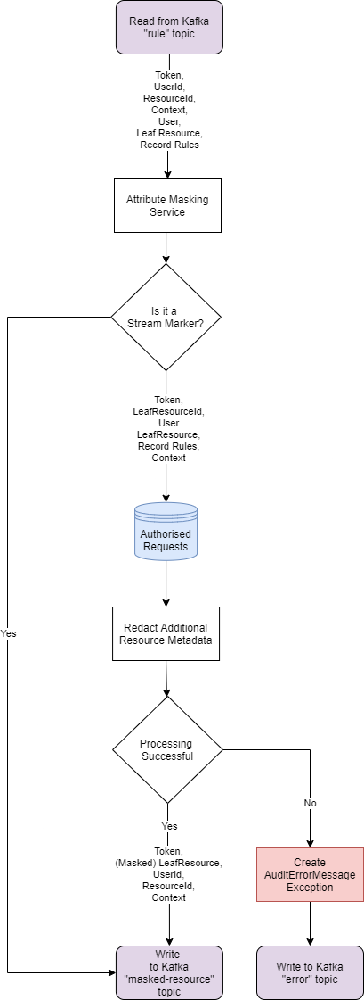

<!---
Copyright 2018-2021 Crown Copyright

Licensed under the Apache License, Version 2.0 (the "License");
you may not use this file except in compliance with the License.
You may obtain a copy of the License at

  http://www.apache.org/licenses/LICENSE-2.0

Unless required by applicable law or agreed to in writing, software
distributed under the License is distributed on an "AS IS" BASIS,
WITHOUT WARRANTIES OR CONDITIONS OF ANY KIND, either express or implied.
See the License for the specific language governing permissions and
limitations under the License.
--->

# 

# Flow of Control



The Attribute-Masking Service will persist authorised requests for later use by the Data Service and modify the request that is sent, via Kafka, to the Topic-Offset Service and Filtered-Resource Service.
This is an interim service on the Palisade stream pipeline that reads each messages sent from the Policy Service.
It will take each of these messages, ascertain if it is a "start" or "end" marker for the set of records (has a token, but the message body is empty of content).
If it is, no further processing is done.
For messages that represent records, these are persisted as authorised requests.
A version of the record message is then prepared with the restricted information redacted or removed which is then forwarded to the next services.
Both types of messages (markers and records) are forwarded to both the Topic-Offset Service and the Filtered-Resource Service.
If at any time during the processing of a message, an error occurs, an error message is produced and sent to the Audit Service.

## Message Model and Database Domain

| AttributeMaskingRequest | AttributeMaskingResponse | AuditErrorMessage | AuthorisedRequestEntity
|:------------------------|:-------------------------|:------------------|:-----------------------
| *token                  | *token                   | *token            | token
| userId                  | userId                   | userId            | uniqueId (token-leafResource.id)
| resourceId              | resourceId               | resourceId        | ---
| context                 | context                  | context           | context
| user                    | maskedLeafResource       | exception         | user
| leafResource            |                          | serverMetadata    | leafResource
| rules                   |                          |                   | rules

*token is in the message header's metadata

The service reads a message in from the `rule` Kafka topic as an [AttributeMaskingRequest](src/main/java/uk/gov/gchq/palisade/service/attributemask/model/AttributeMaskingRequest.java).
This request is first persisted in a store as an`AuthorisedRequestEntity`.
The `LeafResource` in the request holds metadata for the resources that are being requested.
If any of this metadata is classed as restricted data for the request, the metadata is then redacted or removed producing a masked version of the `LeafResource`.
The resulting masked `LeafResource` is then used to create an [AttributeMaskingResponse](src/main/java/uk/gov/gchq/palisade/service/attributemask/model/AuditableAttributeMaskingResponse.java) ready to be forwarded onto the `masked-resource` Kafka topic.
Start and end markers are forwarded to the same topic.
Like the masked resource messages, the start and end markers will have the token (`x-request-token`) in the header, but are different in that they will have an empty message body.
Any error that may occur during the processing of a message, is used to create an error message, `AuditErrorMessage` and sent to the `error` Kafka topic where they are processed by the Audit Service.

## REST Interface

The application provides two service endpoints in the Controller [AttributeMaskingRestController](src/main/java/uk/gov/gchq/palisade/service/attributemask/web/AttributeMaskingRestController.java).
These are to be used for testing and debugging only.
They mimic the Kafka API to the service by processing POST requests into a messages that is put on the upstream topic for the service.
These messages will then later be read by the service.

Single message endpoint [AttributeMaskingRestController.maskAttributes](src/main/java/uk/gov/gchq/palisade/service/attributemask/web/AttributeMaskingRestController.java):
`POST /api/mask`
  - takes an `x-request-token` `String` header, any number of extra headers, and an `AttributeMaskingRequest` body
  - returns a `202 ACCEPTED` after writing the headers and body to kafka

List of message endpoints [AttributeMaskingRestController.maskAttributesMulti](src/main/java/uk/gov/gchq/palisade/service/attributemask/web/AttributeMaskingRestController.java):
`POST /api/mask/multi`
  - takes an `x-request-token` `String` header, any number of extra headers, and a `List` of `AttributeMaskingRequest` body
  - returns a `202 ACCEPTED` after writing the headers and bodies to kafka

## Example JSON Request
```
curl -X POST attribute-masking-service/api/mask -H "x-request-token: test-request-token" -H "content-type: application/json" --data \
'{
  "userId": "test-user-id",
  "resourceId": "/test/resourceId",
  "context": {
    "class": "uk.gov.gchq.palisade.Context",
    "contents": {
      "purpose": "test-purpose"
    }
  },
  "user": {
    "userId": {
      "id": "test-user-id"
    },
    "roles": [],
    "auths": [],
    "class": "uk.gov.gchq.palisade.user.User"
  },
  "resource": {
    "class": "uk.gov.gchq.palisade.resource.impl.FileResource",
    "id": "/test/resourceId",
    "attributes": {},
    "connectionDetail": {
      "class": "uk.gov.gchq.palisade.resource.impl.SimpleConnectionDetail",
      "serviceName": "test-data-service"
    },
    "parent": {
      "class": "uk.gov.gchq.palisade.resource.impl.SystemResource",
      "id": "/test/"
    },
    "serialisedFormat": "avro",
    "type": "uk.gov.gchq.palisade.test.TestType"
  },
  "rules": {
    "message": "no rules set",
    "rules": {}
  }
}'
```
## Example JSON Response
```
{
  "userId": "test-user-id",
  "resourceId": "/test/resourceId",
  "context": {
    "class": "uk.gov.gchq.palisade.Context",
    "contents": {
      "purpose": "test-purpose"
    }
  },
  "resource": {
    "class": "uk.gov.gchq.palisade.resource.impl.FileResource",
    "id": "/test/resourceId",
    "attributes": {},
    "connectionDetail": {
      "class": "uk.gov.gchq.palisade.resource.impl.SimpleConnectionDetail",
      "serviceName": "test-data-service"
    },
    "parent": {
      "class": "uk.gov.gchq.palisade.resource.impl.SystemResource",
      "id": "/test/"
    },
    "serialisedFormat": "avro",
    "type": "uk.gov.gchq.palisade.test.TestType"
  }
}
```
## License
Palisade-Services is licensed under the [Apache 2.0 License](https://www.apache.org/licenses/LICENSE-2.0) and is covered by [Crown Copyright](https://www.nationalarchives.gov.uk/information-management/re-using-public-sector-information/copyright-and-re-use/crown-copyright/).
