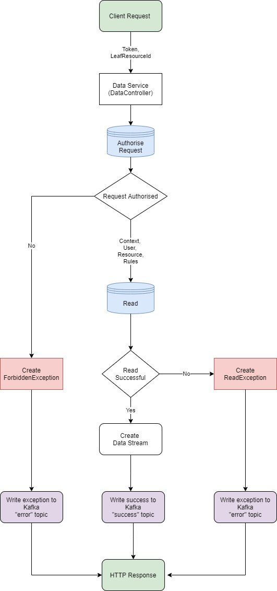

<!---
Copyright 2018-2021 Crown Copyright

Licensed under the Apache License, Version 2.0 (the "License");
you may not use this file except in compliance with the License.
You may obtain a copy of the License at

  http://www.apache.org/licenses/LICENSE-2.0

Unless required by applicable law or agreed to in writing, software
distributed under the License is distributed on an "AS IS" BASIS,
WITHOUT WARRANTIES OR CONDITIONS OF ANY KIND, either express or implied.
See the License for the specific language governing permissions and
limitations under the License.
--->
# 

## A Tool for Complex and Scalable Data Access Policy Enforcement

# Data Service

The Data Service accepts client requests to retrieve resources that have been registered on their behalf.
These will be the response to the initial requests sent to the Palisade service that have been collected, filtered and in conformance to the defined rules and to the context of the request.
The client is expected to send a request containing the token and resource id that is used to uniquely identify the resource request.
The response will be an output stream holding the data resources. 
To see more information on client requests, see the Palisade Client's library.

The key components of the service is the implementation of the [DataService](src/main/java/uk/gov/gchq/palisade/service/data/service/DataService.java) interface and the supporting services.
This comes in the form of an implementation of [DataService](src/main/java/uk/gov/gchq/palisade/service/data/service/DataService.java) interface, [SimpleDataService](src/main/java/uk/gov/gchq/palisade/service/data/service/SimpleDataService.java), that uses the Palisade Reader library for the implementation of a solution using a database. 
This is then wrapped in a class, [AuditableDataService](src/main/java/uk/gov/gchq/palisade/service/data/service/AuditableDataService.java), that will provide the data in a form that can be used in constructing the response that is sent back to the client, and the audit message that is sent to the Audit Service using the [AuditMessageService](src/main/java/uk/gov/gchq/palisade/service/data/service/AuditMessageService.java).


# Flow of Control



The Data Service is implemented as a RESTFul service using the [ChunkedHttpWriter](src/main/java/uk/gov/gchq/palisade/service/data/service/writer/ChunkedHttpWriter.java).
This will start with authorising the request ([DataService.authoriseReqeust](src/main/java/uk/gov/gchq/palisade/service/data/service/DataService.java)).
If successful, the next step will be to read the data ([DataReader.read](src/main/java/uk/gov/gchq/palisade/service/data/service/reader/DataReader.java)) which will return a stream of the data to the client.
Upon completion, an audit success message ([AuditSuccessMessage](src/main/java/uk/gov/gchq/palisade/service/data/model/AuditSuccessMessage.java)) is sent to the Audit Service indicating a successful transfer of the data.
If during the authorisation request or at any time in the read request there is a error, the request is stopped, and an error message ([AuditErrorMessage](src/main/java/uk/gov/gchq/palisade/service/data/model/AuditErrorMessage.java)) is sent to the Audit Service.

Kafka streaming is only used for the processing of audit messages.
This is exposed in the functionality provided by the [AuditMessageService](src/main/java/uk/gov/gchq/palisade/service/data/service/AuditMessageService.java).
This will take both audit success and audit error messages and process them using the functionality provided in the [AkkaRunnableGraph](src/main/java/uk/gov/gchq/palisade/service/data/stream/config/AkkaRunnableGraph.java)'s `runner` method.
In this method, the message types are separated into success and error messages where they are then used to construct messages for the respective kafka error and success topics.


## Message Model and Database Domain

| DataRequest     | (response to client)   | AuditSuccessMessage  | AuditErrorMessage |
|:----------------|:-----------------------|:---------------------|:------------------|
| *token          | InputStream            | *token               | *token            | 
| leafResourceId  |                        | leafResourceId       | leafResourceId    |  
|                 |                        | userId               | ***userId         |
|                 |                        | resourceId           | ***resourceId     |
|                 |                        | context              | ***context        | 
|                 |                        | **attributes         | ***attributes     |
|                 |                        | serverMetadata       | error             |
|                 |                        |                      | serverMetadata    |

*token comes in the body of the request from the client (DataRequest) and is stored in the header metadata for the audit messages  
**attributes will include the numbers for records processed and records returned  
***data that may not be available depending on when the error occurred  


# Flow of Data

The Data Service should be extensible like the User, Resource and Policy Services.
This means being generic over all of the following:
* Readers - different data sources and protocols to read from them such as `HDFS`, `S3`
* Serialisers - different formats for serialised data such as `JSON`, `AVRO`
* Record Types - different record objects to which rules apply such as `Employee`
* Writers - different clients can transform how Palisade is used, but this may require different protocols with the Data Service such as `/read/chunked`


As such, for a given request, the API aims to be as flexible as possible depending on what is required in a given deployment.
The [AbstractResponseWriter](src/main/java/uk/gov/gchq/palisade/service/data/service/writer/AbstractResponseWriter.java) provides a default flow of data that is likely followed by all implementations.
All `@Bean` annotated objects for a `ResponseWriter` will be collected by the [AkkaHttpServer](src/main/java/uk/gov/gchq/palisade/service/data/web/AkkaHttpServer.java) and their `Route` will be added to the server.
Then, the following are used to deduce which implementation of each component to use:
* Http endpoint decides the `ResponseWriter` based on its `Route` as mentioned, e.g. a request to `/read/chunked` would use the `ChunkedHttpWriter`, writing data back as a chunked Http response.
* Resource URI decides the `DataReader` based on its scheme, e.g. a request for `hdfs:/some/file` would use the `HadoopDataReader`.
* Resource Serialised-Format decides the `Serialiser`, using the Resource Type to initialise the serialiser with a `domainClass`.
* Resource Type dictates the Record Type, although no explicit action or decision is taken to this end.


## REST Interface

The application exposes one endpoint to the client for retrieving the resources.
This will be the data that has previously been requested and prepared in the initial request to the Palisade services. 
* `POST data-service/read/chunked`
    - returns a `200 OK` and a streamed HTTP response body which will provide the resource(s).


### Example JSON Request
```
curl -X POST data-service/read/chunked  -H "content-type: application/json" --data \
'{
   "token": "test-token",
   "leafResourceId": "file:/user.json"
 }'
```

### Octet-Stream Response
The response body will be an octet-stream of data from the requested resource with policy rules applied, no matter the file type.
For example, a `user.json` resource might be:
```
{
  usernamne: "alice",
  password: null,
  postcode: "SW1 XXX"
}
```
but a `user.avro` resource will return a non-human-readable binary blob.
