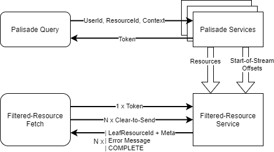
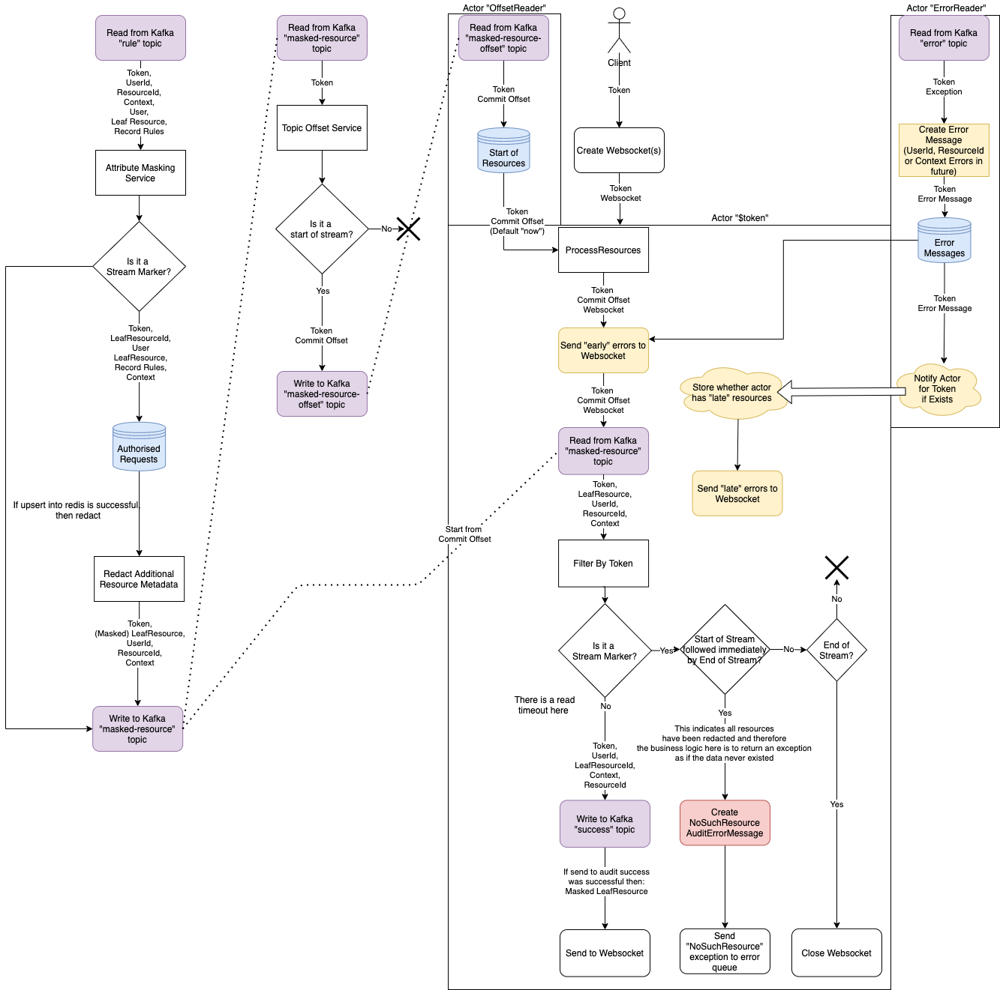
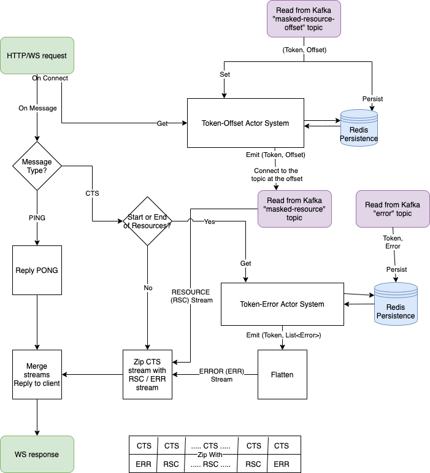
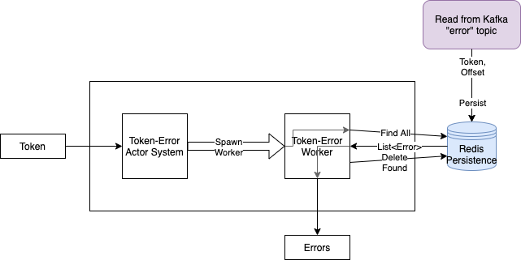

<!---
Copyright 2018-2021 Crown Copyright

Licensed under the Apache License, Version 2.0 (the "License");
you may not use this file except in compliance with the License.
You may obtain a copy of the License at

  http://www.apache.org/licenses/LICENSE-2.0

Unless required by applicable law or agreed to in writing, software
distributed under the License is distributed on an "AS IS" BASIS,
WITHOUT WARRANTIES OR CONDITIONS OF ANY KIND, either express or implied.
See the License for the specific language governing permissions and
limitations under the License.
--->

# 

## A Tool for Complex and Scalable Data Access Policy Enforcement

# Filtered Resource Service



The Filtered-Resource Service sits at the end of the stream pipeline and has the task of returning information about resources (and their connection details) back to the client. 
Given a token `$[token]` from the Palisade Service, it is accessed by a WebSocket request to `ws://filtered-resource-service/resource/${token}`. 
The service will return each resource discovered by the Palisade system one-by-one to the client as requested, auditing that the client is now aware of the resource and effectively authorised to access that resource. 

The expectation is that these resources would either be filtered out by the client as not relevant, or requested to download from the Data Service.

## High-Level Architecture



The above diagram shows the decision-making architecture of the Attribute-Masking Service (left), Topic-Offset Service (middle) and Filtered-Resource Service (right). 
The service connects to three kafka topics as inputs:

* "masked-resource" from the Attribute-Masking Service, containing Leaf Resources for the client's request, stripped of sensitive attributes
* "masked-resource-offset" from the Topic-Offset Service, containing at most one message per token, pointing to the START marker on the "masked-resource" topic for that token
* "error" from all services that may produce errors, containing the error produced

An additional kafka topic is used for auditing the client's access to each returned resource - this is the "success" topic, which will be read later by the Audit Service.

For a given token, the offset (on the "masked-resource" topic) for this token is received from the "masked-resource-offset" and used to create a consumer starting from this point. 
This flow of messages is then filtered by their token (the `X-Request-Token` header on kafka) to match the token supplied by the client. 
Then, as each resource is requested over the websocket, the successful return of each resource to the client is audited to the Audit Service's "success" topic.

As can be seen in the (above) diagram, the service's functions generally fall into one of four responsibilities: 

* Handling incoming web requests, REST or WS (top-centre of diagram, akka-web-server) 
* Persisting and retrieving offsets for tokens (top-left of diagram, blue, token-offset-system) 
* Processing websocket requests and returning resources (bottom of diagram, websocket-event-service) 
* Alerting the client to errors that occurred during processing (right of diagram, yellow, token-error-system)

## Breakdown of Service Components

<!---
See filtered-resource-service/doc/filtered-resource-service.drawio for the source for this diagram.
--->


The main route of web requests - and subsequent websocket messages - through the service is shown in the above diagram. 
The green boxes are client web requests, red boxes are kafka topics, and red storage is redis persistence.

### Token-Offset Actor System

The top-right box is the token-offset-system and its associated worker actors. 
This performs the task of persisting and retrieving offsets for tokens. 
We use an Akka Actor System to process both requests from the client and messages from kafka. 
The first diagram below shows what happens when a client connects to the service before the request has been processed by Palisade.
The second diagram below shows what happens when a client connects to the service after the request has been processed by Palisade.

#### Early Client Connection


If the client connects to the service before the request has been processed by Palisade an Akka Actor Worker is spawned, which deals with the incoming offset value.
The service will then read a message from the `masked-resource-offset` Kafka topic.
The service will tell the Akka Actor Worker the offset value which is then used by the service to read the resources from the `masked-resource` Kafka topic.

#### Late Client Connection


If the client connects to the service after Palisade has finished processing the request the information from the `masked-resource-offse` Kafka topic is stored in Redis.
The `GET` from the client triggers the service to spawn an Akka Actor Worker.
The worker will then check Redis for any values that match the incoming token value.
This is then set on the worker which then reads values from the `masked-resource` Kafka topic from the offset value.

### Token-Error Actor System

The bottom-right box is the token-error-system and its associated worker actors. 
This performs the task of persisting and retrieving errors for tokens. 
We use an Akka Actor System to process requests from the client. 
For a given token, all errors matching the token are looked-up from redis. 
This list of errors are then deleted from redis and emitted by the actor. 



### WebSocket Event Service

The left-half is the WebSocket-event-service. 
An instance of this service is created for each open client WebSocket connection. 
The client and server communicate using the following protocol:

| Client Request | Server Response                | Notes
|:---------------|:-------------------------------|:----------------
| PING           | PONG                           | Application-level ping-pong liveliness check - note that this is different to [protocol-level PING/PONG frames](https://tools.ietf.org/html/rfc6455#section-5.5.2)
| CTS            | RESOURCE, ERROR, COMPLETE      | A client's clear-to-send message is met with either a RESOURCE from the server (id, type, format, connection-detail) or an ERROR (message-details). Once all RESOURCEs and ERRORs are exhausted, then a COMPLETE message is returned.

In particular, the Filtered-Resource Service checks for errors *twice* - once before any resources and once after.
This means 'early' errors that came in *before* the client connected (eg. from the User Service) are delivered to the client sooner, and they may choose to re-register a request.
'Late' errors, those which arrived *after* the client connected are then delivered only after all resources have been delivered, alerting the client that their result set may be incomplete, allowing them to choose whether to re-register their request or continue.
This minimises the number of queries to the error persistence store per client, while also providing prompt notification of errors.

### Akka Web Server

The akka-web-server plays a simple but key role in the service, providing both HTTP and WS endpoints for client connections. 
It is not present in the above diagram as the decision flow is trivial (just a collection of endpoints, most backed by existing Spring or Akka mechanisms). 
It exposes the following HTTP REST endpoints:

| Request Type   | Endpoint                       | Notes
|:---------------|:-------------------------------|:----------------
| GET            | `/actuator/health/$component`  | Provides an indicator for application health for a given component (can be empty), backed by Spring's health mechanism
| GET, POST      | `/actuator/loggers/$package`   | Get or set logging level for a given package (can be empty), backed by Spring's logging mechanism
| POST           | `/api/{resource,offset,error}` | Write a payload to an (upstream) kafka queue such that it will then be processed by the service

It also exposes the following Websocket endpoint:

| Request Type   | Endpoint                       | Notes
|:---------------|:-------------------------------|:----------------
| WS_UPGRADE     | `/resource/$token`             | Connect to the service and carry out the websocket protocol described above. There will be no indication from the server as to whether the provided token is valid until a RESOURCE, ERROR or COMPLETE message is received.


## Example Data Payloads

The Filtered-Resource Service requires a number of inputs from separate services to produce its results; as such, orchestrating a manual interaction with the service is quite verbose. 
The steps required are as follows:

1. POST onto the masked-resource queue (`http://filtered-resource-service/api/masked-resource`) as if an output has come from the Attribute-Masking Service
    * This includes an additional pair of empty `START` and `END` of stream messages before and after the request payload respectively
    * Additionally, all three of these messages (and all further messages) will include a `test-token` in the header - this is our token from the Palisade Service
1. POST onto the masked-resource-offset queue (`http://filtered-resource-service/api/masked-resource-offset`) the offset of our START marker
    * This doesn't have to be accurate, as long as it is less-than-or-equal-to the actual value - we will use `0` as our offset
1. Open a WS connection to `ws://filtered-resource-service/resource/$token` (this example will use [Hashrocket's ws tool](https://github.com/hashrocket/ws))
1. Send CTS messages from the client until the server responds with COMPLETE

### Auditing within the Filtered Resource Service
The Filtered Resource Service will send audit messages, specifically an `AuditErrorMessage` to the Audit Service via the error topic for the two following cases:
1. No start marker was observed before reading the resources. 
   If resources are processed by the Filtered-Resource Service before a start marker is observed, it could indicate that there is an issue earlier on in the system which could cause the messages to fall out of order. 
   In this case, an Audit Error Message is created, containing a `NoStartMarkerObserved` exception, which is then sent to the Audit Service, and finally, the processing of the request is stopped. 
2. No Resources were contained in the request. 
   If a start marker is observed, but no resources are contained in the request, the request could be invalid, for resources that aren't known to Paliasde, or for resources that have been redacted. 
   In this case, an Audit Error Message is created, containing a `NoResourcesObserved` exception, and is then sent to the Audit Service. 

## Message Model
| FilteredResourceRequest | WebSocketMessage | TopicOffsetMessage | AuditSuccessMessage | AuditErrorMessage |
|-------------------------|------------------|--------------------|---------------------|-------------------|
| *token                  | *token           | queuePointer       | *token              | *token            |
| userId                  | messageType      |                    | userId              | userId            |
| resourceId              | LeafResource     |                    | resourceId          | resourceId        |
| context                 |                  |                    | context             | context           |
| LeafResource            |                  |                    | serverMetadata      | exception         |
|                         |                  |                    | attributes          | serverMetadata    |
|                         |                  |                    |                     | attributes        |

### JSON REST Requests

1. Mimicking the Attribute-Masking Service:
   ```bash
   curl -X POST http://filtered-resource-service/api/masked-resource -H "X-Request-Token: test-request-token" -H "X-Stream-Marker: START"

   curl -X POST http://filtered-resource-service/api/masked-resource -H "X-Request-Token: test-request-token" -H "content-type: application/json" --data \
   '{
      "userId": "userId",
      "resourceId": "file:/file/",
      "context": {
         "class": "uk.gov.gchq.palisade.Context",
         "contents": {
            "purpose": "purpose"
         }
      },
      "resource": {
         "class": "uk.gov.gchq.palisade.resource.impl.FileResource",
         "id": "file:/file/resource.1",
         "attributes": {},
         "connectionDetail": {
            "class": "uk.gov.gchq.palisade.resource.impl.SimpleConnectionDetail",
            "serviceName": "data-service"
         },
         "parent": {
            "class": "uk.gov.gchq.palisade.resource.impl.SystemResource",
            "id": "file:/file/"
         },
         "serialisedFormat": "fmt",
         "type": "type"
      }
   }'

   curl -X POST http://filtered-resource-service/api/masked-resource -H "X-Request-Token: test-request-token" -H "X-Stream-Marker: END"
   ```

1. Mimicking the Topic-Offset Service:
   ```bash
   curl -X POST http://filtered-resource-service/api/masked-resource-offset -H "X-Request-Token: test-request-token" -H "content-type: application/json" --data '{"commitOffset":0}'
   ```

### JSON WS Interaction

Using a preferred WebSocket command-line tool (using [ws](https://github.com/hashrocket/ws), where `>` is sent from the client to the server, and `<` is received by the client from the server):

```bash
ws ws://filtered-resource-service/resource/test-token
> {"type":"CTS","headers":{},"body":null}
< {"type":"RESOURCE","headers":{"X-Request-Token":"test-token"},"body":{"class":"uk.gov.gchq.palisade.resource.impl.FileResource","id":"file:/file/resource.1","attributes":{},"connectionDetail":{"class":"uk.gov.gchq.palisade.resource.impl.SimpleConnectionDetail","serviceName":"data-service"},"parent":{"class":"uk.gov.gchq.palisade.resource.impl.SystemResource","id":"file:/file/"},"serialisedFormat":"fmt","type":"type"}}
> {"type":"CTS","headers":{},"body":null}
< {"type":"COMPLETE","headers":{"X-Request-Token":"test-token"}}
```
