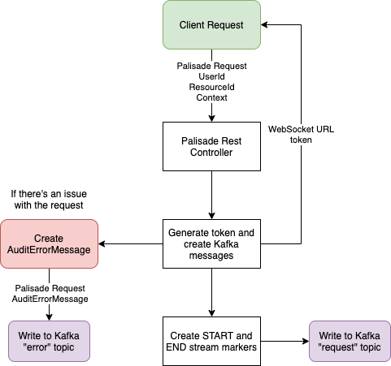

<!---
Copyright 2018-2021 Crown Copyright

Licensed under the Apache License, Version 2.0 (the "License");
you may not use this file except in compliance with the License.
You may obtain a copy of the License at

  http://www.apache.org/licenses/LICENSE-2.0

Unless required by applicable law or agreed to in writing, software
distributed under the License is distributed on an "AS IS" BASIS,
WITHOUT WARRANTIES OR CONDITIONS OF ANY KIND, either express or implied.
See the License for the specific language governing permissions and
limitations under the License.
--->

# 

# Palisade Service

The Palisade Service is the entry point into the rest of the Palisade Services, it accepts a request from the client, containing the userId of the user requesting access, 
the resource the user wants access to, and a reason as to why they require access. 
The Palisade Service then creates a token, currently via the UUIDPalisadeService, but this can be extended in the future for specific token requirements. 
The token is attached to the message in the form of a `PalisadeSystemResponse` to be sent to the User Service on the `user` kafka topic. 
It is also sent back to the client directly as part of a `PalisadeClientResponse` so that the client can connect to the Filtered Resource Service to retrieve the processed data.
As the data progresses through the other Palisade services, it is refined and enriched, the Palisade Service is the entry point for client requests.

## High-Level Architecture
<!--- 
See palisade-service/doc/palisade-service.drawio for the source of this diagram
--->

The routing of requests is shown in the diagram above. The yellow boxes indicate the client, and the purple are kafka topics.

## Message Model and Database Domain

| PalisadeClientRequest | PalisadeClientResponse | PalisadeSystemResponse | AuditErrorMessage | 
|:----------------------|:-----------------------|:-----------------------|:------------------|
| userId                | *token                 | *token                 | *token            | 
| resourceId            |                        | userId                 | userId            |  
| context               |                        | resourceId             | resourceId        |
|                       |                        | context                | context           | 
|                       |                        |                        | exception         | 
|                       |                        |                        | serverMetadata    | 

(fields marked with * are acquired from headers metadata)

The service accepts a `PalisadeClientRequest`, containing the userId, resourceId and context, it then generates a token, using the `UUIDPalisadeService`, which along-side the original request information,
is packaged in a `PalisadeSystemResponse` and sent onwards via the `user` kafka topic to the User service for further processing. 
The token is also added to a `PalisadeClientResponse` object, which is sent back to the client, so that they can request the processed data from the Filtered Resource Service.

## REST Interface

Palisade Service exposes two REST endpoints:

* `POST palisade/registerDataRequest`
    - accepts an `x-request-token` `String` header, any number of extra headers, and an `PalisadeClientRequest` body
    - returns a `202 ACCEPTED` and a `PalisadeClientResponse` containing a token, after writing the headers and body to the `user` kafka topic

## Kafka Interface

The application receives a REST request containing a `PalisadeClientRequest`, and after returning a token to the client, creates the information we need for Kafka, including a Start and End of Stream message, containing the relevant headers. 
It then creates a message in-between the start and end, containing the `PalisadeClientRequest` object, which contains the user, resourceId and context. 
The `x-request-token` is sent in the Kafka headers. In case of errors, the original request and thrown exception are both captured in an `AuditablePalisadeSystemResponse` and the error is written to the Kafka `error` topic.

## Example JSON Request

```
curl -X POST palisade-service/api/registerDataRequest -H "content-type: application/json" --data \
'{
   "userId":"testUserId",
   "resourceId":"/test/resourceId",
   "context":{
      "purpose":"testContext"
   }
}'
```

## Example JSON Response

```
{
   "token":"df3fc6ef-3f8c-48b4-ae1b-5f3d8ad32ead"
}
```

## License

Palisade-Services is licensed under the [Apache 2.0 License](https://www.apache.org/licenses/LICENSE-2.0) and is covered
by [Crown Copyright](https://www.nationalarchives.gov.uk/information-management/re-using-public-sector-information/copyright-and-re-use/crown-copyright/).
