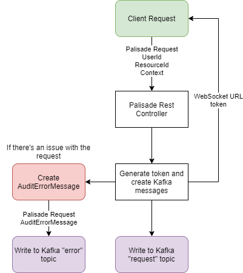

<!---
Copyright 2018-2021 Crown Copyright

Licensed under the Apache License, Version 2.0 (the "License");
you may not use this file except in compliance with the License.
You may obtain a copy of the License at

  http://www.apache.org/licenses/LICENSE-2.0

Unless required by applicable law or agreed to in writing, software
distributed under the License is distributed on an "AS IS" BASIS,
WITHOUT WARRANTIES OR CONDITIONS OF ANY KIND, either express or implied.
See the License for the specific language governing permissions and
limitations under the License.
--->

# 

# Palisade Service

The Palisade Service is the entry point into the rest of the Palisade Services, it accepts a request from the client and passes it forwards to the User Service to continue on the processing of the request. 
The client then receives a token used to connect to the Filtered Resource Service and retrieve the processed request.

## High-Level Architecture
<!--- 
See palisade-service/doc/palisade-service.drawio for the source of this diagram
--->

THe routing of requests is shown in the diagram above. The yellow boxes indicate the client, and the purple are kafka topics.

## Message Model and Database Domain

| PalisadeRequest | PalisadeClientResponse | PalisadeSystemResponse | AuditErrorMessage | 
|:----------------|:-----------------------|:-----------------------|:------------------|
| userId          | *token                 | userId                 | *token            | 
| resourceId      |                        | resourceId             | userId            |  
| context         |                        | context                | resourceId        |
|                 |                        |                        | context           | 
|                 |                        |                        | exception         | 
|                 |                        |                        | serverMetadata    | 

(fields marked with * are acquired from headers metadata)

The service accepts a `PalisdeRequest`, creates a token to return to the client as a `PalisadeResponse`, the Palisade Service then takes the user, resourceId and context from the `PalisadeRequest`, and sends them on to the User Service for further processing.

## REST Interface

The application exposes two REST endpoints:

* `POST palisade/registerDataRequest`
    - accepts an `x-request-token` `String` header, any number of extra headers, and an `PalisadeRequest` body
    - returns a `202 ACCEPTED` and a `PalisadeResponse` containing a token, after writing the headers and body to kafka

## Kafka Interface

The application receives a REST request containing a `PalisadeRequest`, and after returning a token to the client, creates the information we need for Kafka, including a Start and End of Stream message, containing the relevant headers. 
It then creates a message in-between the start and end, containing the `PalisadeRequest` object, which contains the user, resourceId and context. 
The `x-request-token` is sent in the Kafka headers. In case of errors, the original request and thrown exception are both captured in an `AuditablePalisadeSystemResponse` and the error is written to the Kafka `error` topic.

## Example JSON Request

```
curl -X POST palisade-service/api/registerDataRequest -H "content-type: application/json" --data \
'{
   "userId":"testUserId",
   "resourceId":"/test/resourceId",
   "context":{
      "purpose":"testContext"
   }
}'
```

## Example JSON Response

```
{
   "token":"df3fc6ef-3f8c-48b4-ae1b-5f3d8ad32ead"
}
```

## License

Palisade-Services is licensed under the [Apache 2.0 License](https://www.apache.org/licenses/LICENSE-2.0) and is covered
by [Crown Copyright](https://www.nationalarchives.gov.uk/information-management/re-using-public-sector-information/copyright-and-re-use/crown-copyright/).
