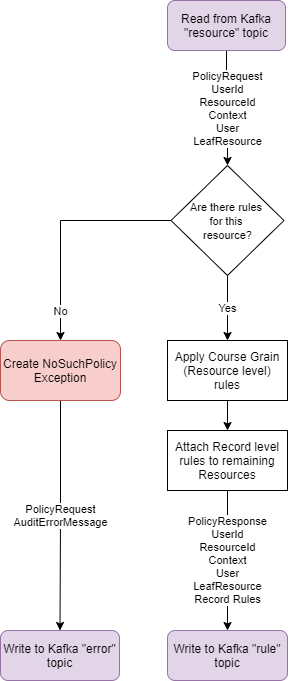

<!---
Copyright 2018-2021 Crown Copyright

Licensed under the Apache License, Version 2.0 (the "License");
you may not use this file except in compliance with the License.
You may obtain a copy of the License at

  http://www.apache.org/licenses/LICENSE-2.0

Unless required by applicable law or agreed to in writing, software
distributed under the License is distributed on an "AS IS" BASIS,
WITHOUT WARRANTIES OR CONDITIONS OF ANY KIND, either express or implied.
See the License for the specific language governing permissions and
limitations under the License.
--->

# 

# Policy Service

The responsibility of the Policy Service is to provide the set of rules (filters or transformations) that need to be
applied to each resource that has been requested, based the User and Context.

## High Level Architecture

<!--- 
See policy-service/doc/policy-service.drawio for the source of this diagram
--->


## Message Model

| PolicyRequest           | PolicyResponse           | AuditErrorMessage |
|:------------------------|:-------------------------|:------------------|
| *token                  | *token                   | *token            |
| userId                  | userId                   | userId            |
| resourceId              | resourceId               | resourceId        |
| context                 | context                  | context           |
| user                    | user                     | exception         |
| resource                | resource                 | serverMetadata    |
|                         | rules                    |                   |

(fields marked with * are acquired from headers metadata)

The service accepts a `PolicyRequest` and a token created by the [Palisade Service](../palisade-serivce), then checks for rules, or policies in the cache; the technology of which is chosen in the Policy Service's application.yaml and Spring profiles. 
First, the Policy Service looks for resource level rules, these are rules that can be applied to any part of the resource path, and could limit what resources the User has access to. These are also known as course grain rules within Palisade. 
The Policy Service recursively checks the parents of the resource for any record level rules, also known as fine grain rules, and applies them to the resource before continuing. 
If no record or resource level rules are found for this resource, a `NoSuchPolicyException` is thrown.
An `AuditErrorMessage` is then built, containing the user information, context, resourceId, the error thrown, and any additional attributes. 
This error object is then sent with the `PolicyRequest` to the [Audit service](../audit-service) to be audited appropriately.
If, however, resource level rules are found, and when applied against the resource, the resource has not been redacted, then the Policy Service will check the cache for Record Level rules. 
Record Level Rules are rules that can be applied against the data itself, and based off context can limit what the user can see in a particular resource.
These rules are not yet applied, but are attached to the original request and packaged as a `PolicyResponse` which then is finally built as a `AuditablePolicyResponse` object with no errors
This is then sent, via Kafka, to the [Attribute-Masking Service](../attribute-masking-service) for further processing.


## REST Interface

The application exposes two REST endpoints used for debugging or mocking the kafka entrypoint:
* `POST api/policy`
    - accepts an `x-request-token` `String` header, any number of extra headers, and a single `PolicyRequest` in the body
    - returns a `202 ACCEPTED` after writing the headers and `PolicyRequest` to kafka
* `POST api/policy/multi`
    - accepts an `x-request-token` `String` header, any number of extra headers, and a list of `PolicyRequest`s within the body
    - returns a `202 ACCEPTED` after writing the headers and `PolicyRequest` to kafka

## Example JSON Request
```
curl -X POST policy-service/api/policy -H "x-request-token: test-request-token" -H "content-type: application/json" --data \
'{
  "userId": "test-user-id",
  "resourceId": "/test/resourceId",
  "context": {
    "class": "uk.gov.gchq.palisade.Context",
    "contents": {
      "purpose": "test-purpose"
    }
  },
  "user": {
    "userId": {
      "id": "test-user-id"
    },
    "roles": [],
    "auths": [],
    "class": "uk.gov.gchq.palisade.user.User"
  },
  "resource": {
    "class": "uk.gov.gchq.palisade.resource.impl.FileResource",
    "id": "/test/resourceId",
    "attributes": {},
    "connectionDetail": {
      "class": "uk.gov.gchq.palisade.resource.impl.SimpleConnectionDetail",
      "serviceName": "test-data-service"
    },
    "parent": {
      "class": "uk.gov.gchq.palisade.resource.impl.SystemResource",
      "id": "/test/"
    },
    "serialisedFormat": "avro",
    "type": "uk.gov.gchq.palisade.test.TestType"
  }
}'
```

## Example JSON Kafka Topic ('rule') Output
```json
{
  "userId": "test-user-id",
  "resourceId": "/test/resourceId",
  "context": {
    "class": "uk.gov.gchq.palisade.Context",
    "contents": {
      "purpose": "test-purpose"
    }
  },
  "user": {
    "userId": {
      "id": "test-user-id"
    },
    "roles": [],
    "auths": [],
    "class": "uk.gov.gchq.palisade.user.User"
  },
  "resource": {
    "class": "uk.gov.gchq.palisade.resource.impl.FileResource",
    "id": "/test/resourceId",
    "attributes": {},
    "connectionDetail": {
      "class": "uk.gov.gchq.palisade.resource.impl.SimpleConnectionDetail",
      "serviceName": "test-data-service"
    },
    "parent": {
      "class": "uk.gov.gchq.palisade.resource.impl.SystemResource",
      "id": "/test/"
    },
    "serialisedFormat": "avro",
    "type": "uk.gov.gchq.palisade.test.TestType"
  },
  "rules": {
    "message": "Some message about the policy",
    "rules": {
      "Serialised format rule":"uk.gov.gchq.palisade.contract.policy.common.SerialisedFormatRule"
    }
  }
}
```

## Policy pre-population / Cache Warming
This service can be populated with a list of initial users at start-up.
By specifying all the configuration and pre-population factory values, any policy information in the configuration list will be added to the service at runtime.
This includes being added to the cache, so that the basic `NullPolicyService` implementation, coupled with the `PolicyServiceCachingProxy`, acts solely using the cache.

**Note:** This means that after the cache eviction TTL (Time To Live), found in [application.yaml](src/main/resources/application.yaml), the Policy Service will no longer contain any policy information.

An example of this can be seen in this [Test Yaml](src/contract-tests/resources/application-pre-population.yaml) file which adds a basic rule to the cache when the service starts up.
```yaml
population:
  policyProvider: std
  policies:
  - resourceId: /test/noRulesResource

  - resourceId: /test/resourceId
    resourceRules:
      "1-Pass Through Rule": uk.gov.gchq.palisade.service.policy.rule.PassThroughRule
    recordRules:
      "1-Pass Through Rule": uk.gov.gchq.palisade.service.policy.rule.PassThroughRule
```

How to override the uploaded rules:
1. Create a new `PolicyConfiguration` class
2. Create a new `PolicyPrepopulationFactory` class
3. Create a new `ApplicationConfiguration` class that includes a bean for the new `PolicyConfiguration` and `PolicyPrepopulationFactory` classes.
   They should be conditional on the property `policyProvider` from within a yaml file.
4. Create a new application yaml file that defines the `policyProvider` value and includes a list of record and resource level rules, that are to be added to the backing store

## License

Palisade-Services is licensed under the [Apache 2.0 License](https://www.apache.org/licenses/LICENSE-2.0) and is covered by [Crown Copyright](https://www.nationalarchives.gov.uk/information-management/re-using-public-sector-information/copyright-and-re-use/crown-copyright/).
