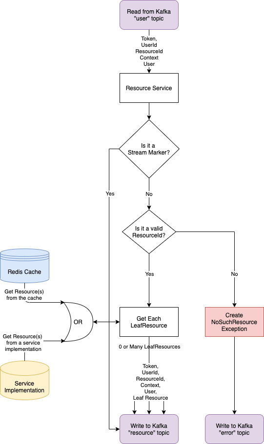

<!---
Copyright 2018-2021 Crown Copyright

Licensed under the Apache License, Version 2.0 (the "License");
you may not use this file except in compliance with the License.
You may obtain a copy of the License at

  http://www.apache.org/licenses/LICENSE-2.0

Unless required by applicable law or agreed to in writing, software
distributed under the License is distributed on an "AS IS" BASIS,
WITHOUT WARRANTIES OR CONDITIONS OF ANY KIND, either express or implied.
See the License for the specific language governing permissions and
limitations under the License.
--->

# 

# Resource Service

At it's core, the Resource Service is an implementation of the `ResourceService` interface found [here](https://github.com/gchq/Palisade-common/blob/develop/src/main/java/uk/gov/gchq/palisade/service/ResourceService.java). 

This implementation is then wrapped with various service layers to work with the Palisade streaming architecture. 
These additional layers include:
* Pulling requests from an upstream kafka topic and writing responses to a downstream topic, or an error topic if an exception was thrown -
  see [AkkaRunnableGraph](src/main/java/uk/gov/gchq/palisade/service/resource/stream/config/AkkaRunnableGraph.java)
* Calling the provided implementation of the `ResourceService` -
  see [SimpleResourceService](src/main/java/uk/gov/gchq/palisade/service/resource/service/SimpleResourceService.java) or [ConfiguredHadoopResourceService](src/main/java/uk/gov/gchq/palisade/service/resource/service/ConfiguredHadoopResourceService.java)
* 'Caching' resources returned by previous `ResourceService` calls -
  see [ResourceServicePersistenceProxy](src/main/java/uk/gov/gchq/palisade/service/resource/service/ResourceServicePersistenceProxy.java) and [ReactivePersistenceLayer](src/main/java/uk/gov/gchq/palisade/service/resource/repository/ReactivePersistenceLayer.java)

> :warning:
One provided implementation of this `ResourceService` interface is the [ConfiguredHadoopResourceService](src/main/java/uk/gov/gchq/palisade/service/resource/service/ConfiguredHadoopResourceService.java). 
Windows users will have problems with Hadoop integration testing. 
Included [here](src/component-tests/resources/hadoop-3.2.1/bin) is a Windows-compatible set of hadoop binaries. 
To 'install' on Windows, copy the [hadoop.dll](src/component-tests/resources/hadoop-3.2.1/bin/hadoop.dll) to `C:\Windows\System32`. 
This should enable the `HadoopResourceServiceTest` to run correctly. 


## Flow of Control



### [AkkaRunnableGraph](src/main/java/uk/gov/gchq/palisade/service/resource/stream/config/AkkaRunnableGraph.java)
The Resource Service accepts an incoming message from the `user` Kafka topic as processed by the [User Service](../user-service) which contains the `resourceId` that is being accessed. 
This `resourceId` could be an actual file, or a directory that could contain many files and/or sub-directories. 
The `resourceId` is then used as a query returning all `LeafResource`s under that path (eg. this may be all files in all (sub-)directories).
All the returned resources will be within an Akka stream and each element in the stream is added to the `resource` Kafka topic to be processed by the [Policy Service](../policy-service). 
If an exception was thrown, it is written to the `error` Kafka topic, along with suitable identifying metadata. 

### [ResourceServicePersistenceProxy](src/main/java/uk/gov/gchq/palisade/service/resource/service/ResourceServicePersistenceProxy.java)
The service will then query the 'cache' backing store to see if the requested `resourceId` has been stored. 
A successful response from this implementation will then be added to the backing store, but errors are ignored. 
If this is not the case then the request will be passed onto the local implementation of the Resource Service. 

### ResourceService implementation, eg. [SimpleResourceService](src/main/java/uk/gov/gchq/palisade/service/resource/service/SimpleResourceService.java)
The `resourceId` is treated as a file path in this case, and the returned resources come from Java's `Files::walk`. 


## Kafka Message Model

| ResourceRequest | ResourceResponse | AuditErrorMessage | 
|:----------------|:-----------------|:------------------| 
| *token          | *token           | *token            | 
|  userId         |  userId          |  userId           | 
|  resourceId     |  resourceId      |  resourceId       | 
|  context        |  context         |  context          | 
|  user           |  user            |  exception        | 
|                 |  resource        |  serverMetadata   | 

(fields marked with `*` are acquired from headers metadata)

The service accepts a `ResourceRequest` from the User service and finds all the resources associated with the resourceId as a stream. 
The stream is then consumed and for each resource a `ResourceResponse` is created and then sent to the Policy service for further processing. 

The application receives 3 messages for each token, a `START` message, a message containing a `ResourceRequest` and an `END` message. 
The `START` gets consumed by the service, it is then acknowledged as the start of the resources and is then written to the `resource` Kafka topic. 
The `ResourceRequest` message then gets consumed by the service and for each resource a `ResourceResponse` object is created. 
This then gets written to the `resource` Kafka topic. 
Once all the`ResourceResponse`s have been written to the topic, the `END` message gets written to the `resource` topic to mark the end of the resources for this request. 
If any errors are thrown within the service, the original request, along with the thrown exception are captured in an `AuditErrorMessage` and written to the Kafka `error` topic. 

### Stream Markers

The use of these `START` and `END` marker messages are because of a combination of the Resource, Policy and Filtered Resource Services. 
For a given token and resourceId requested, the Resource Service may produce an unknown number of `ResourceResponse`s. 
The `START` and `END` allow for any number of messages in between to be arbitrarily created, deleted, and delayed as long as the collection starts and ends the same. 
For this reason, it is important that messages on a given partition remain strictly ordered - as such, most `PARALLELISM` values are set to `1`. 


## REST Interface

The application exposes one REST endpoint for the purpose of debugging:

* `POST /api/resource`
    - accepts an `x-request-token` `String` header, any number of extra headers, and a `ResourceRequest` body
    - returns an ACCEPTED to indicate the request has been written to the upstream 'user' topic

### Example JSON Request

```
curl -X POST api/resource -H "content-type: application/json" --data \
{
   "userId":"test-user-id",
   "resourceId":"file:/test/resourceId/",
   "context":{
      "class":"uk.gov.gchq.palisade.Context",
      "contents":{
         "purpose":"test-purpose"
      }
   },
   "user":{
      "userId":{
         "id":"test-user-id"
      },
      "roles":[
         "role"
      ],
      "auths":[
         "auth"
      ],
      "class":"uk.gov.gchq.palisade.User"
   }
}
```

### Example JSON Kafka Topic ('resource') Output

```
{
   "userId":"test-user-id",
   "resourceId":"file:/test/resourceId/",
   "context":{
      "class":"uk.gov.gchq.palisade.Context",
      "contents":{
         "purpose":"test-purpose"
      }
   },
   "user":{
      "userId":{
         "id":"test-user-id"
      },
      "roles":[
         "role"
      ],
      "auths":[
         "auth"
      ],
      "class":"uk.gov.gchq.palisade.User"
   },
   "resource":{
      "class":"uk.gov.gchq.palisade.resource.impl.FileResource",
      "id":"file:/test/resourceId/data1.txt",
      "attributes":{
         
      },
      "connectionDetail":{
         "class":"uk.gov.gchq.palisade.service.SimpleConnectionDetail",
         "serviceName":"data-service"
      },
      "parent":{
         "class":"uk.gov.gchq.palisade.resource.impl.DirectoryResource",
         "id":"file:/test/resourceId/",
         "parent":null
      },
      "serialisedFormat":"txt",
      "type":"type"
   }
}
```


## Resource 'Cache'

### Motivation

To ease load on an external resource-service provider, a cache-like storage mechanism is used to return data for previously-queried resources. 
The code for this is mostly found in the [ReactivePersistenceLayer](src/main/java/uk/gov/gchq/palisade/service/resource/repository/ReactivePersistenceLayer.java). 

Due to the tree-structure of filesystems, native caching of requests-to-responses results in a large amount of data while not providing any "smart" methods to the caching mechanism. 
For example, requesting `/some/directory/with-lots-of-files` may return (and cache) 1000 resources, but requesting `/some/directory` will result in a cache miss, as would `/some/directory/with-lots-of-files/big-subdirectory`. 
Instead, a persistence store is used to break resource trees apart into their individual nodes and store them separately, reconstructing parents and tree structure when requested again.

### Database Entities and Structuring

```
                            === CompletenessEntity ====
                            |* entity-id : String     |
             ---------------|* entity-type : Enum     |---------------
             |              ---------------------------              |
             |                           |                           |
             V                           V                           V
=== ResourceEntity ======== === TypeEntity ============ === SerialisedFmtEntity ===
|* resource-id: String    | |* type: String           | |* serialised-fmt: String |
|* parent-id: String      | |  resource-id: String    | |  resource-id: String    |
|  resource: JSON         | --------------------------- ---------------------------
---------------------------
```

(fields marked with `*` are indexable)

### Implementation

The persistence store is split into a number of separate repositories, one for each queryable index on a resource (i.e. resource-id, type, format). 
These indexable fields are referred to in code through an EntityType enum. 
These each store only "complete" sets of information - directories for which have been queried in their entirety, either by directly requesting it, or requesting one of its parents. 
A separate repository stores pairs of resource-ids and entity-types. 

A request to the resource-service may then look like:

* Get resources by some indexable field (or member of the [`EntityType` enum](src/main/java/uk/gov/gchq/palisade/service/resource/domain/EntityType.java) enum, say `resource-id`)
* Check the [Completeness Repository](src/main/java/uk/gov/gchq/palisade/service/resource/repository/CompletenessRepository.java) for whether the "cache" can return a "complete" set of information
    * If the `entity-type`-`resource-id` pair is found, continue to return from our "cache", otherwise return from the real resource-service
    * If returning from the real resource-service, insert these new resources into the "cache"
* Get by the indexable field in the appropriate repository
    * [Type Repository](src/main/java/uk/gov/gchq/palisade/service/resource/repository/TypeRepository.java) and [Serialised Format Repository](src/main/java/uk/gov/gchq/palisade/service/resource/repository/SerialisedFormatRepository.java) are not tree-like
      and return a collection of leaf-resource-ids to directly get-and-return
    * [Resource Repository](src/main/java/uk/gov/gchq/palisade/service/resource/repository/ResourceRepository.java) is tree-like, so we need to recursively get the child resources
        * Query the repository recursively for a collection of resources with a parent matching our current node
* Re-assemble the parents of all our leaf-resources
    * Query the [Resource Repository](src/main/java/uk/gov/gchq/palisade/service/resource/repository/ResourceRepository.java) for resources matching our node's parent-id
* Return the completed result

This is all achieved in non-blocking reactive streams, allowing for large datasets and long IO-blocking service queries with minimal memory and CPU footprint.

### Pre-populating the Resource Service and Cache Warming

It may be that some example resources may need to be added to the backing store before a test run of the Palisade system gets performed.
This is done by using Spring to add resource(s) to the implementation using data sourced from a yaml profile.
An example of this can be seen in this [testresource.yaml](src/contract-tests/resources/application-testresource.yaml) file which adds the resource information to the backing store when the service starts up.


## License

Palisade-Services is licensed under the [Apache 2.0 License](https://www.apache.org/licenses/LICENSE-2.0) and is covered by [Crown Copyright](https://www.nationalarchives.gov.uk/information-management/re-using-public-sector-information/copyright-and-re-use/crown-copyright/).
