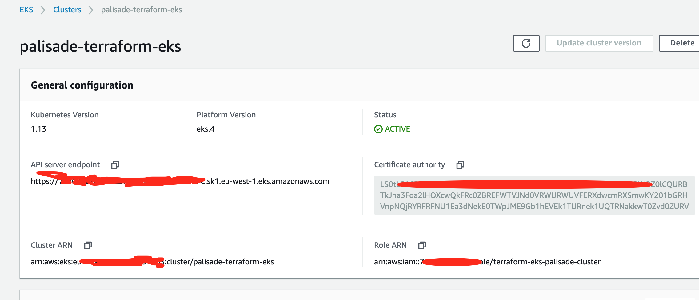

<!---
Copyright 2019 Crown Copyright

Licensed under the Apache License, Version 2.0 (the "License");
you may not use this file except in compliance with the License.
You may obtain a copy of the License at

  http://www.apache.org/licenses/LICENSE-2.0

Unless required by applicable law or agreed to in writing, software
distributed under the License is distributed on an "AS IS" BASIS,
WITHOUT WARRANTIES OR CONDITIONS OF ANY KIND, either express or implied.
See the License for the specific language governing permissions and
limitations under the License.
--->


# 

### EKS terraform deployment
The terraform here creates an EKS cluster and includes the following resources:
1. EKS Cluster: AWS managed Kubernetes cluster of master servers.
1. AutoScaling Group containing 2 m4.large instances based on the latest EKS Amazon Linux 2 AMI: Operator managed Kubernetes worker nodes for running Kubernetes service deployments
1. Associated VPC, Internet Gateway, Security Groups, and Subnets: Operator managed networking resources for the EKS Cluster and worker node instances
1. Associated IAM Roles and Policies: Operator managed access resources for EKS and worker node instances

The code has been adapted from the following [link](https://learn.hashicorp.com/terraform/aws/eks-intro)

The code uses a backend configuration (see backend.tf) - the bucket configuration will need to be modified to point to an S3 bucket you create for the storage of state:

Use the following aws command to create a bucket:

```bash
aws s3 mb s3://<<bucket name to add to backend.tf>> --region eu-west-1
```

Ensure you have permissions to do the following (this can be done from the aws command line if you as a user have these permissions or alternatively by attaching a role to an EC2 instance with these permissions:

If you are using an EC2 instance for executing the terraform you will need to install terraform v0.12.7 or greater as well as aws-iam-authenticator.
Create a role as per below and attach this to the EC2 instance. Run the following:

```bash
curl http://169.254.169.254/latest/meta-data/iam/security-credentials/<<role name>>
```

This will produce a time limited access key, secret access key and token which can be used in the usual way to configure aws.

Run the following command on the EC2 instance to ensure that the credentials are correct:

```bash
aws s3 ls
```


```json
{
    "Version": "2012-10-17",
    "Statement": [
        {
            "Sid": "VisualEditor0",
            "Effect": "Allow",
            "Action": [
                "ec2:CreateDhcpOptions",
                "ec2:AuthorizeSecurityGroupIngress",
                "iam:List*",
                "ec2:AttachInternetGateway",
                "iam:PutRolePolicy",
                "iam:AddRoleToInstanceProfile",
                "ec2:UpdateSecurityGroupRuleDescriptionsIngress",
                "ec2:DeleteRouteTable",
                "ec2:DeleteVpnGateway",
                "ec2:RevokeSecurityGroupEgress",
                "ec2:CreateRoute",
                "ec2:CreateInternetGateway",
                "ec2:DeleteInternetGateway",
                "autoscaling:DeleteTags",
                "ec2:Associate*",
                "iam:GetRole",
                "s3:PutAccountPublicAccessBlock",
                "iam:GetPolicy",
                "ec2:CreateTags",
                "iam:DeleteRole",
                "ec2:RunInstances",
                "ec2:AssignPrivateIpAddresses",
                "ec2:CreateVolume",
                "ec2:RevokeSecurityGroupIngress",
                "ec2:CreateNetworkInterface",
                "autoscaling:AttachInstances",
                "ec2:DeleteDhcpOptions",
                "ec2:DeleteNatGateway",
                "autoscaling:DeleteAutoScalingGroup",
                "s3:CreateJob",
                "eks:ListClusters",
                "ec2:CreateSubnet",
                "iam:GetRolePolicy",
                "autoscaling:DetachInstances",
                "ec2:ModifyVpcEndpoint",
                "iam:CreateInstanceProfile",
                "ec2:CreateNatGateway",
                "ec2:CreateVpc",
                "ec2:ModifySubnetAttribute",
                "iam:PassRole",
                "ec2:CreateDefaultSubnet",
                "iam:DeleteRolePolicy",
                "ec2:DeleteLaunchTemplateVersions",
                "eks:CreateCluster",
                "iam:DeleteInstanceProfile",
                "ec2:ReleaseAddress",
                "ec2:DeleteLaunchTemplate",
                "s3:*",
                "autoscaling:CreateLaunchConfiguration",
                "iam:CreatePolicy",
                "ec2:Describe*",
                "s3:GetAccountPublicAccessBlock",
                "ec2:CreateLaunchTemplate",
                "s3:ListAllMyBuckets",
                "ec2:Disassociate*",
                "iam:UpdateAssumeRolePolicy",
                "iam:GetPolicyVersion",
                "ec2:DeleteSubnet",
                "iam:RemoveRoleFromInstanceProfile",
                "iam:CreateRole",
                "eks:UpdateClusterConfig",
                "iam:AttachRolePolicy",
                "ec2:DeleteVolume",
                "iam:DetachRolePolicy",
                "ec2:GetLaunchTemplateData",
                "autoscaling:UpdateAutoScalingGroup",
                "s3:HeadBucket",
                "ec2:DetachVolume",
                "ec2:UpdateSecurityGroupRuleDescriptionsEgress",
                "autoscaling:SetDesiredCapacity",
                "ec2:DescribeLaunchTemplates",
                "s3:ListJobs",
                "ec2:CreateRouteTable",
                "ec2:DeleteNetworkInterface",
                "autoscaling:SuspendProcesses",
                "ec2:DetachInternetGateway",
                "eks:DeleteCluster",
                "autoscaling:CreateOrUpdateTags",
                "eks:DescribeCluster",
                "iam:DeleteServiceLinkedRole",
                "ec2:DeleteVpc",
                "ec2:CreateEgressOnlyInternetGateway",
                "autoscaling:CreateAutoScalingGroup",
                "autoscaling:Describe*",
                "ec2:DeleteTags",
                "iam:DeletePolicy",
                "ec2:CreateSecurityGroup",
                "ec2:ModifyVpcAttribute",
                "iam:CreatePolicyVersion",
                "ec2:AuthorizeSecurityGroupEgress",
                "ec2:DeleteEgressOnlyInternetGateway",
                "ec2:DetachNetworkInterface",
                "iam:GetInstanceProfile",
                "ec2:DeleteRoute",
                "ec2:DescribeLaunchTemplateVersions",
                "ec2:AllocateAddress",
                "ec2:CreateLaunchTemplateVersion",
                "autoscaling:DeleteLaunchConfiguration",
                "eks:DescribeUpdate",
                "ec2:DeleteSecurityGroup",
                "ec2:ModifyLaunchTemplate",
                "ec2:AttachNetworkInterface"
            ],
            "Resource": "*"
        }
    ]
}
```

You will need to create a terraform.tfvars file with the following content:
A helper script has been created that pulls out a named security group definition.

```bash
./extractIpAddreses > terraform.tfvars
```

```json
cidr-access-group = [
  "X.X.X.X/XX",
  "Y.Y.Y.Y/YY"]
  
cidr-block = "any /16 ip address"

cluster-name = "any cluster name"  


```

You will also need to create a backend.tf file with the following content:
```json
terraform {
  backend "s3" {
    bucket = "bucket to use for terraform deployment"
    key = "state location within the bucket"
    region = "region to deploy to"
  }
}
```

Run the following commands in order to deploy the EKS cluster:

```json
terraform init -var-file="terraform.tfvars"
terraform plan -var-file="terraform.tfvars"
terraform apply -var-file="terraform.tfvars"
```

After a few minutes the EKS cluster will be created - see diagram below:




In order to access the cluster, you will need to create a kubeconfig file (default in ~/.kube/config) as follows:


```json
apiVersion: v1
clusters:
- cluster:
    server: <<server end point from EKS cluster definition>>
    certificate-authority-data: <<Certificate authority>>
  name: kubernetes
contexts:
- context:
    cluster: kubernetes
    user: aws
  name: aws
current-context: aws
kind: Config
preferences: {}
users:
- name: aws
  user:
    exec:
      apiVersion: client.authentication.k8s.io/v1alpha1
      command: aws-iam-authenticator
      args:
        - "token"
        - "-i"
        - "<<EKS cluster name>>"
```

For a new cluster you should run the following command and see "No resources found"

```bash
kubectl get pods
```
```bash
kubectl cluster-info
```


