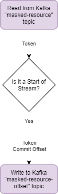

<!---
Copyright 2018-2021 Crown Copyright

Licensed under the Apache License, Version 2.0 (the "License");
you may not use this file except in compliance with the License.
You may obtain a copy of the License at

  http://www.apache.org/licenses/LICENSE-2.0

Unless required by applicable law or agreed to in writing, software
distributed under the License is distributed on an "AS IS" BASIS,
WITHOUT WARRANTIES OR CONDITIONS OF ANY KIND, either express or implied.
See the License for the specific language governing permissions and
limitations under the License.
--->

# 

# Topic Offset Service


## High Level Architecture

<!--- 
See topic-offset-service/doc/topic-offset-service.drawio for the source of this diagram
--->


## Message Model

| TopicOffsetRequest | TopicOffsetResponse | 
|:-------------------|:--------------------|
| *token             | *token              | 
| userId             | commitOffset        | 
| resourceId         |                     | 
| context            |                     | 
| resource           |                     | 
  
(fields marked with * are acquired from headers metadata)

The Topic-Offset Service monitors and watches the `masked-resource` Kafka topic and reports the offsets that satisfy some prerequisites. 
This service accepts a `TopicOffsetRequest`, which contains a token, it is then used to subscribe to the kafka topic and check for a Start of Stream message, declared in the `StreamMarker` class. 
When a Start of Stream message is observed, the commitOffset is retrieved, and sent onward to the [Filtered-Resource Service](../filtered-resource-service) to point the Filtered-Resource Service to the commitOffset on the Kafka topic.

## REST Interface

The application exposes two REST endpoints used for debugging or mocking the kafka entrypoint:
* `POST api/offset`
  - accepts an `x-request-token` `String` header, any number of extra headers, and a single `TopicOffsetRequest` in the body
  - returns a `202 ACCEPTED` after writing the headers and `TopicOffsetRequest` to kafka
* `POST api/offset/multi`
  - accepts an `x-request-token` `String` header, any number of extra headers, and a list of `TopicOffsetRequest`s within the body
  - returns a `202 ACCEPTED` after writing the headers and `TopicOffsetRequest` to kafka

## Example JSON Request
```
curl -X POST topic-offset-service/api/offset -H "x-request-token: test-request-token" -H "content-type: application/json" --data \
'{
    "userId":"test-user-id",
    "resourceId":"file:/test/resourceId/",
    "context":{
       "class":"uk.gov.gchq.palisade.Context",
       "contents":{
          "purpose":"test-purpose"
       }
    },
    "user":{
       "userId":{
          "id":"test-user-id"
       },
       "roles":[
          "role"
       ],
       "auths":[
          "auth"
       ],
       "class":"uk.gov.gchq.palisade.user.User"
    }
 }'
```


## Example JSON Kafka Topic ('masked-resource-offset') Output
```
'{
   "commitOffset": 101
 }'
```

## License

Palisade-Services is licensed under the [Apache 2.0 License](https://www.apache.org/licenses/LICENSE-2.0) and is covered by [Crown Copyright](https://www.nationalarchives.gov.uk/information-management/re-using-public-sector-information/copyright-and-re-use/crown-copyright/).
