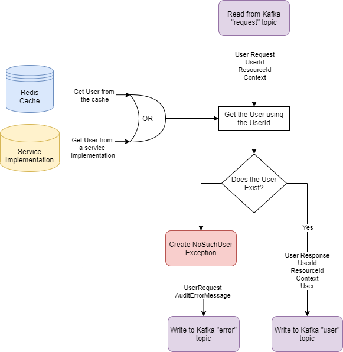

<!---
Copyright 2018-2021 Crown Copyright

Licensed under the Apache License, Version 2.0 (the "License");
you may not use this file except in compliance with the License.
You may obtain a copy of the License at

  http://www.apache.org/licenses/LICENSE-2.0

Unless required by applicable law or agreed to in writing, software
distributed under the License is distributed on an "AS IS" BASIS,
WITHOUT WARRANTIES OR CONDITIONS OF ANY KIND, either express or implied.
See the License for the specific language governing permissions and
limitations under the License.
--->

# 

# User Service

The User Service is responsible for providing the other Palisade components with knowledge of the users of the system. 
Note that we are avoiding having a separate notion of "Palisade" users that are distinct from the normal user accounts of the system. 
There is no such thing as a "Palisade" user.  
One of the purposes of this service is to allow Palisade to adopt whatever notion of *user* the host environment has. 
For example, this may come from a central directory service such as LDAP, 
host operating system account or PKI based user authentication.
The User Service separates this concern from the rest of the system. Other components use this service's API to request user details. 
Some deployments may also allow Palisade to add users to the system, hence the presence of the `addUser()` method in the `UserService` interface.

## High Level Architecture

<!--- 
See user-service/doc/user-service.drawio for the source of this diagram
--->


## Message Model

| UserRequest     | UserResponse     | AuditErrorMessage |
|:----------------|:-----------------|:------------------|
| *token          | *token           | *token            |
| userId          | userId           | userId            |
| resourceId      | resourceId       | resourceId        |
| context         | context          | context           |
|                 | User             | exception         |
|                 |                  | serverMetadata    |
  
(fields marked with * are acquired from headers metadata)

The service accepts a `UserRequest` and a token, then checks if the User is in the cache; the technology of which is chosen in the User Services application.yaml 
and Spring profiles. If the User exists in the cache, then it, alongside any additional attributes, are retrieved and used to create a `UserReponse` object 
which is then packaged into a `AuditableUserResponse` object with no errors. This is then sent, via Kafka, to the [Resource Service](../resource-service) for further processing. 
If the User does not exist in the cache then the request gets directed to the local implementation of the User service. If the User service implementation returns a User then a 
`UserResponse` object gets created and added to an `AuditableUserResponse` object which is sent to the [Resource service](../resource-service).
Should any errors get thrown when trying to access a User, for example a `NoSuchUserIdException`, then this information creates an `AuditErrorMessage` 
that is then sent to the [Audit service](../audit-service) to be audited appropriately.

## REST Interface

The application exposes two REST endpoints used for debugging or mocking the kafka entrypoint:
* `POST api/user`
  - accepts an `x-request-token` `String` header, any number of extra headers, and a single `UserRequest` in the body
  - returns a `202 ACCEPTED` after writing the headers and `UserRequest` to kafka
* `POST api/user/multi`
  - accepts an `x-request-token` `String` header, any number of extra headers, and a list of `UserRequest`s within the body
  - returns a `202 ACCEPTED` after writing the headers and `UserRequest` to kafka

## Example JSON Request
```
curl -X POST user-service/api/user -H "x-request-token: test-request-token" -H "content-type: application/json" --data \
'{
   "userId": "test-user-id",
   "resourceId": "/test/resourceId",
   "context": {
     "class": "uk.gov.gchq.palisade.Context",
     "contents": {
       "purpose": "purpose"
     }
   }
 }'
```


## Example JSON Kafka Topic ('user') Output
```
'{
  "userId": "test-user-id",
  "resourceId": "/test/resourceId",
  "context": {
    "class": "uk.gov.gchq.palisade.Context",
    "contents": {
      "purpose": "purpose"
    }
  },
  "user": {
    "userId": {
      "id": "test-user-id"
    },
    "roles": [
      "roles"
    ],
    "auths": [
      "auths"
    ],
    "class": "uk.gov.gchq.palisade.User"
  }
}'
```

## User pre-population / Cache Warming

This service can be populated with a list of initial users at start-up.
By specifying all the configuration and pre-population factory values, any user information in the configuration list will be added to the service at runtime.
This includes being added to the cache, so that the basic `NullUserService` implementation, coupled with the `UserServiceCachingProxy`, acts solely using the cache.

**Note:** This means that after the cache eviction TTL (Time To Live), found in [application.yaml](src/main/resources/application.yaml), the User Service will no longer contain any user information.
 
An example of this can be seen in this [Test Yaml](src/contract-tests/resources/application-pre-population.yaml) file which adds a basic user to the cache when the service starts up.

How to override the uploaded users:
1. Create a new `User` class
1. Create a new `UserConfiguration` class
1. Create a new `UserPrepopulationFactory` class
1. Create a new `ApplicationConfiguration` class that includes a bean for the new `UserConfiguration` and `UserPrepopulationFactory` classes. 
   They should be conditional on the property `userProvider` from within a yaml file.
1. Create a new application yaml file that defines the `userProvider` value and includes a list of users, with all their fields and respective values (if required), that are to be added to the backing store

### Notes

The API is reasonably simple at present, and it is likely that this interface will grow.
Specifically, we anticipate that `UserService` implementations will connect to an account provisioning service as explained above, which will let Palisade retrieve the details of users that it previously knows nothing about. 
That is, we do **not** expect that every user retrieved via `getUser` will have previously been added via a corresponding `addUser` call.

## License

Palisade-Services is licensed under the [Apache 2.0 License](https://www.apache.org/licenses/LICENSE-2.0) and is covered by [Crown Copyright](https://www.nationalarchives.gov.uk/information-management/re-using-public-sector-information/copyright-and-re-use/crown-copyright/).
